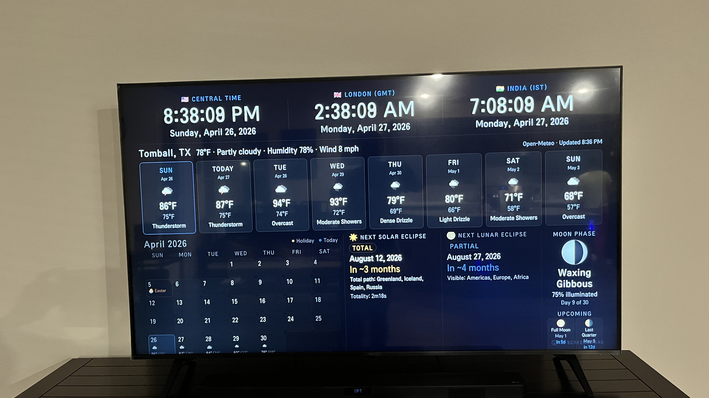
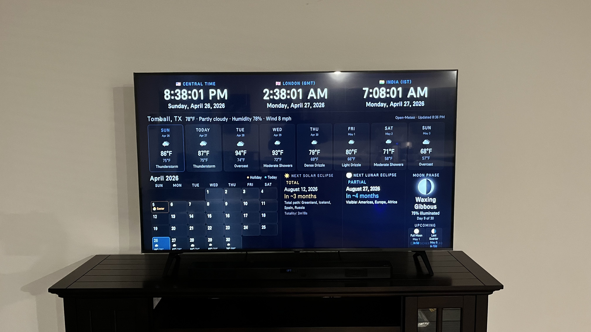
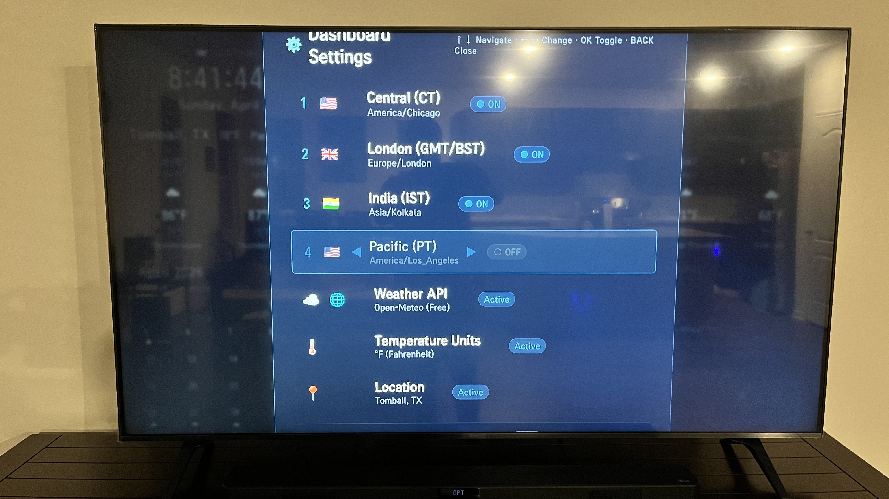
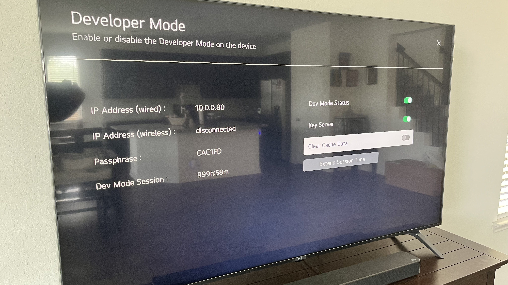

<div align="center">

# 📺 LG ScreenBoard

### A full-screen, always-on information dashboard for LG webOS TVs

[](LICENSE)
[](https://webostv.developer.lge.com)
[](https://open-meteo.com)
[](#)

**Dual clocks · 8-day weather · Moon phase · Solar & lunar eclipse countdowns**  
Designed to run 24/7 on any LG webOS smart TV. No subscription. No cloud account. No fees.

</div>

---

## 📸 Screenshots

| Dashboard | Full Room View |
|:---------:|:--------------:|
|  |  |

| Settings Panel (via TV remote) | Developer Mode Setup |
|:------------------------------:|:--------------------:|
|  |  |

---

## ⚠️ Important: Not an Automatic Screensaver

> **LG webOS does NOT support third-party automatic screensavers.**
>
> LG's operating system reserves the idle/screensaver slot exclusively for its own built-in screensaver. There is **no public API** that allows a sideloaded app to launch automatically when the TV is idle, run in the background, or replace the system screensaver. This is a hard platform restriction — it cannot be worked around.
>
> **LG ScreenBoard must be launched manually** from Home → My Apps each time. Once running, it stays on indefinitely with no timeout.

---

## Why This Exists

LG webOS smart TVs have **no built-in way** to show a custom clock, weather, or information dashboard. The LG Content Store does not allow third-party screensaver or always-on apps. LG ScreenBoard fills that gap — install it once via Developer Mode and launch it manually. Once running, it stays on indefinitely as a persistent, TV-optimized info display.

---

## ✨ Features

| Module | Details |
|--------|---------|
| 🕒 **Multi-Timezone Clocks** | Up to 4 simultaneous clocks, 30 timezone options, configurable via remote |
| 🌤 **8-Day Weather Forecast** | Daily hi/lo temps, conditions, icons — powered by Open-Meteo (free, no key) |
| 🌙 **Moon Phase** | Real-time phase name, illumination %, canvas-rendered disc, upcoming phases |
| ☀️ **Solar Eclipse Countdown** | Next eclipse type, date, path, and totality duration from NASA catalog |
| 🌕 **Lunar Eclipse Countdown** | Next eclipse type, date, visibility region from NASA catalog |
| 📅 **Calendar** | Full monthly calendar with US federal holidays highlighted |
| ⚙️ **Remote-Only Settings** | Change timezone, location, weather units, API provider — no keyboard needed |
| 🔒 **Burn-in Protection** | Floating particles, diagonal scan sweep, section fades, layout drift |
| 🎨 **OLED-Safe Design** | Pure black background, high-contrast text, TV-optimized font sizing |

---

## 🚀 Quick Start

### Prerequisites

- LG webOS TV (versions 3.x – 7.x)
- Developer Mode enabled on the TV ([how-to below](#enabling-developer-mode))
- [webOS CLI](https://webostv.developer.lge.com/develop/tools/cli-introduction) installed on your PC:
  ```bash
  npm install -g @webos-tools/cli
  ```

### 1 — Configure your location

Edit [`config.js`](config.js):

```js
LOCATION: {
  lat:  30.0972,    // your latitude
  lon: -95.6167,    // your longitude
  name: 'Your City, ST'
},
WEATHER_UNITS: 'imperial',   // 'imperial' (°F) or 'metric' (°C)
```

No API key needed — uses [Open-Meteo](https://open-meteo.com) by default (free, no account).

### 2 — Package

```bash
ares-package . --outdir ./build --no-minify
```

### 3 — Register your TV

```bash
ares-setup-device --add lgtv --info "{\"host\":\"YOUR_TV_IP\",\"port\":9922,\"username\":\"prisoner\"}"
ares-novacom --device lgtv --getkey   # enter passphrase from Developer Mode app
```

> **Node.js v22+ users:** See the [full installation guide](INSTALLATION_STEPS.md) for a one-time SSH key and ares-cli patch.

### 4 — Install & Launch

```bash
ares-install --device lgtv ./build/com.screenboard.app_1.0.0_all.ipk
ares-launch  --device lgtv com.screenboard.app
```

The app appears in **Home → My Apps** on your TV.

---

## 🎮 Remote Control

| Button | Action |
|--------|--------|
| **OK** | Open Settings panel |
| **↑ / ↓** | Navigate between settings rows |
| **← / →** | Change value (timezone, city, units, API) |
| **OK** on clock row | Toggle clock slot ON / OFF |
| **BACK** | Close settings and save |
| **BACK** (on dashboard) | Exit app |

All settings persist across TV reboots via localStorage.

---

## 🌤 Weather APIs

| Provider | Cost | API Key | Forecast |
|----------|------|---------|----------|
| **Open-Meteo** *(default)* | Free forever | None | 8-day daily |
| OpenWeatherMap | Free tier | Required | 8-day (One Call 3.0) or 5-day (2.5) |

Switch providers at any time from the Settings panel — no repackaging.

---

## 🌑 Eclipse Data

Eclipse catalog is sourced from the **[NASA Eclipse Website](https://eclipse.gsfc.nasa.gov)** and covers **2025–2032**. Fully offline — no network request needed.

---

## 📁 File Structure

```
├── appinfo.json       — webOS app manifest
├── index.html         — Dashboard layout
├── styles.css         — All CSS (TV-optimized, OLED-safe)
├── config.js          — Your settings (location, timezones, units)
├── app.js             — Boot, remote control, settings panel
├── weather.js         — Open-Meteo + OpenWeatherMap integration
├── moon.js            — Moon phase algorithm + canvas renderer
├── eclipse.js         — NASA solar & lunar eclipse catalog
├── calendar.js        — Monthly calendar + US holidays
├── holidays.js        — US federal holiday definitions
├── utils/
│   └── time.js        — Multi-timezone clock engine
└── assets/
    ├── icon.png            — App icon (80×80)
    ├── largeIcon.png       — Large icon (130×130)
    └── screenshots/        — Demo photos
```

---

## 📺 Enabling Developer Mode

1. On your LG TV: **Home → LG Content Store** → search **"Developer Mode"** → Install
2. Open the Developer Mode app and toggle **Developer Mode ON**
3. Note your **IP address** and **passphrase** shown on screen
4. Reboot the TV when prompted

> Developer Mode sessions last up to **1000 hours**. Click **Extend Session Time** in the app before it expires to keep access.

---

## 🔧 Full Installation Guide

For the complete step-by-step guide including SSH key setup, Node.js v24 compatibility patch, and troubleshooting, see **[INSTALLATION_STEPS.md](INSTALLATION_STEPS.md)**.

---

## ⚠️ Limitations

LG webOS is a closed platform with hard restrictions on sideloaded apps:

| Limitation | Why |
|------------|-----|
| ❌ **Cannot run as automatic screensaver** | LG webOS has no API for third-party screensavers. The idle/screensaver slot is owned by the OS and cannot be replaced by any sideloaded app — period. |
| ❌ Cannot auto-launch on TV idle | No idle hook or background service API is available to third-party devs |
| ❌ Cannot overlay on other apps | webOS does not allow floating windows from sideloaded apps |
| ❌ Cannot run in the background | App must be in the foreground to execute |
| ✅ **Runs indefinitely once launched** | No timeout, no sleep — stays on as long as the TV is on |
| ✅ Persists all settings across reboots | Stored in localStorage |

> **Bottom line:** You must launch LG ScreenBoard manually each time. Think of it as a dedicated display mode you switch the TV into, not a screensaver.

See [LIMITATIONS.md](LIMITATIONS.md) for the complete list.

---

## 🗺 Roadmap

Planned features:

- [ ] Sunrise / sunset times
- [ ] Air Quality Index (AQI)
- [ ] Eclipse path map visualization
- [ ] Multi-city weather side by side
- [ ] Stock ticker / market summary
- [ ] Sports scores widget
- [ ] Custom background / theme colors

See [ROADMAP.md](ROADMAP.md) for details.

---

## 🤝 Contributing

Contributions are welcome! Please open an issue first to discuss what you'd like to change.

See [CONTRIBUTING.md](CONTRIBUTING.md) for guidelines.

---

## 📄 License

**MIT License** — free to use, modify, and distribute. See [LICENSE](LICENSE) for full text.

---

## 🙏 Acknowledgements

- [Open-Meteo](https://open-meteo.com) — free open-source weather API, no key required
- [OpenWeatherMap](https://openweathermap.org) — weather icons and paid API option
- [NASA Eclipse Website](https://eclipse.gsfc.nasa.gov) — eclipse catalog data
- [LG webOS TV Developer Docs](https://webostv.developer.lge.com) — platform reference

---

<div align="center">

**Built with ❤️ for LG TV owners who want more from their screen**

[Report a Bug](https://github.com/jaimalleshk/LG-TV-Screensaver-Time-Weather-Dashboard/issues) · [Request a Feature](https://github.com/jaimalleshk/LG-TV-Screensaver-Time-Weather-Dashboard/issues) · [Installation Guide](INSTALLATION_STEPS.md)

</div>
